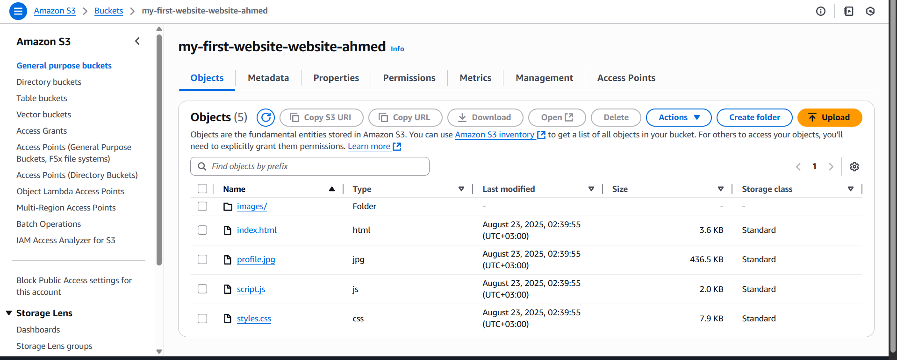
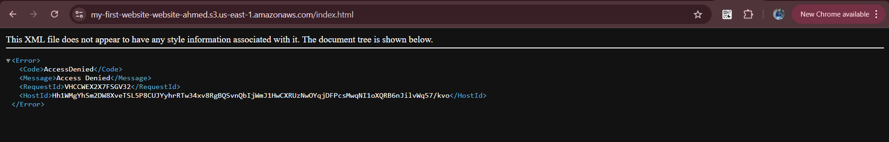
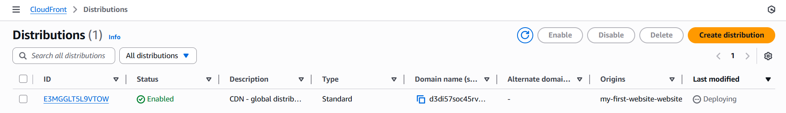
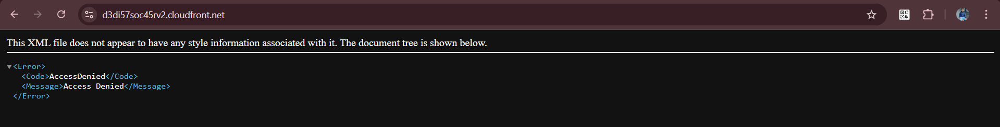
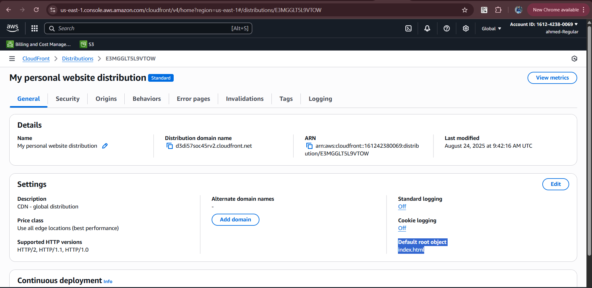
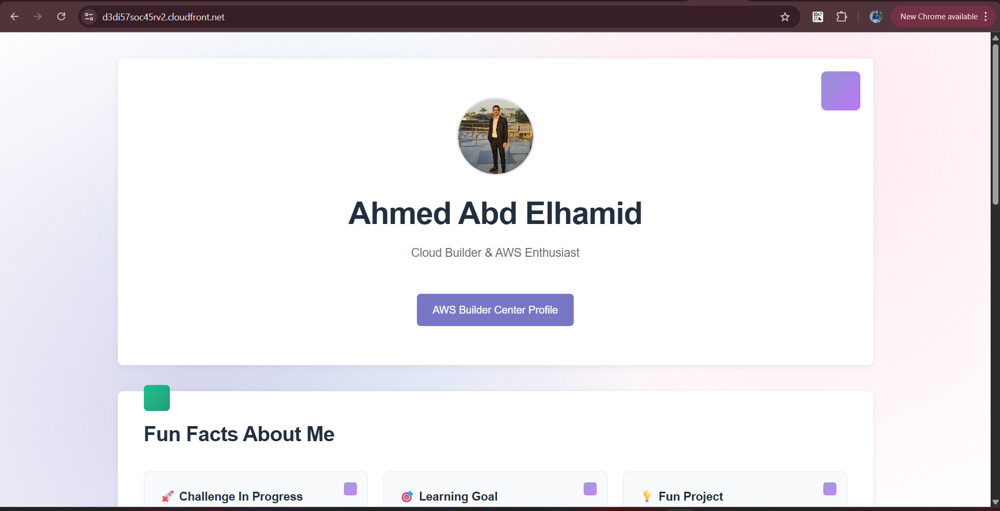

# 🚀 Deploying a Secure, Global Website with AWS S3, CloudFront & Amplify

Welcome! This guide walks you through deploying a fast and secure website using **AWS S3**, **CloudFront (CDN)**, and **AWS Amplify** integrated with **GitHub**. Follow each step for a professional, scalable setup! 🌍🔒

---

## 1️⃣ Create Your Private S3 Bucket

- ✅ **Upload** your website contents to a "private storage bucket".
- 🔒 **Block all Public Access** to the bucket for maximum security.

> **Why is this important?**  
> Your files remain securely stored and inaccessible to the public. We'll use CloudFront to serve them globally via HTTPS for security and speed.




---

## 2️⃣ Set Up CloudFront Global Distribution 🌐

**Purpose of creating the CDN:**
- 🌏 Distribute your content worldwide
- ⚡️ Speed up website delivery
- 🛡️ Improve reliability — if one server fails, others take over
- 💸 Save on costs — less load on your main server

#### Steps:
```bash
CloudFront → Create Distribution
→ Name & Distribution type: Single website or app ("Skip" custom domain setup)
→ Origin type: Amazon S3 → S3 origin: Browse S3
→ Origin path: (leave empty unless files are in a subfolder)
→ Settings: Allow private S3 bucket access to CloudFront
→ Origin access: Origin access control settings (recommended)
→ Origin settings & Cache settings: Use recommended
→ Security: "Do not enable security protections" (skip)
→ Review & Create
```


---

## 3️⃣ Configure Your Homepage 🏠

When users access the **root URL** (e.g., `https://your-site.com`), CloudFront needs to know which file to show (usually `index.html`). If not set, visitors will see an error.



#### Solution:
```bash
CloudFront Settings → Edit → Set Default Root Object → index.html → Save
```
Now, visitors automatically see your homepage!

---

## 4️⃣ Test Your Global Website 🌎

- ⏳ **Wait for global deployment**: Distribution status will show "Deploying" for 5-15 minutes.  
  (This copies your content to servers worldwide.)




### ✅ Output Example



> 🔐 **Direct S3 access remains blocked.**  
> Your storage bucket stays private and secure.


---

## 5️⃣ Deploy with AWS Amplify + GitHub 🤖

**Problem:**  
Manual updates require uploading new files to S3 and handling CloudFront cache — time-consuming and error-prone.

**Solution:**  
Integrate **GitHub** with **AWS Amplify**:
- 📝 Every code change is tracked & versioned
- 🌐 Update your website automatically after each commit
- 🚫 No more manual uploads or cache management
- 🏆 Adopt the professional workflow used by developers worldwide!

---

## 🎯 Summary

- ✅ **S3 Bucket**: Secure & private storage
- 🌍 **CloudFront**: Fast, reliable global CDN delivery
- 🤖 **Amplify + GitHub**: Automated, professional deployments

---

> Ready to deploy? Your website is now secure, fast, and professionally managed!  
> Happy coding! ✨
