# 🚀 Deploying a Secure, Global Website with AWS S3, CloudFront & Amplify

Welcome! This guide walks you through deploying a fast and secure website using **AWS S3**, **CloudFront (CDN)** (Manual Build), and **AWS Amplify** with **GitHub** (Automated Build).  
Follow these steps for a professional, scalable setup! 🌍🔒

---

## 1️⃣ Create Your Private S3 Bucket

- ✅ **Upload** your website contents to a "private storage bucket".
- 🔒 **Block all Public Access** for maximum security.

> **Why is this important?**  
> Your files are securely stored and not publicly accessible. We'll use CloudFront to serve them globally via HTTPS for security and speed.


---

## 2️⃣ Set Up CloudFront Global Distribution 🌐

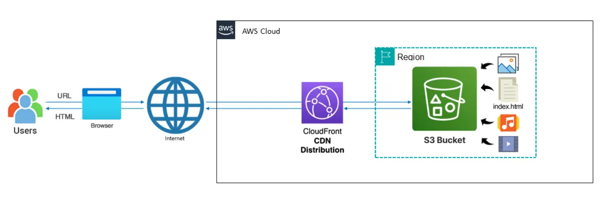

**Why use a CDN?**
- 🌏 **Global Reach:** Distribute your content worldwide
- ⚡️ **Speed:** Serve your website quickly everywhere
- 🛡️ **Reliability:** If one server fails, others take over
- 💸 **Cost Savings:** Less load on your main server

#### Steps:
```bash
CloudFront → Create Distribution
→ Name & Distribution type: Single website or app ("Skip" custom domain setup)
→ Origin type: Amazon S3 → S3 origin: Browse S3
→ Origin path: (leave empty unless files are in a subfolder)
→ Settings: Allow private S3 bucket access to CloudFront
→ Origin access: Origin access control settings (recommended)
→ Origin settings & Cache settings: Use recommended
→ Security: "Do not enable security protections" (skip)
→ Review & Create
```


---

## 🏠 Configure Your Homepage

When users access your **root URL** (like `https://your-site.com`), CloudFront needs to know which file to show (usually `index.html`). If not set, visitors see an error.


#### Solution:
```bash
CloudFront Settings → Edit → Set Default Root Object → index.html → Save
```
Now, visitors always see your homepage!

---

## 🌎 Test Your Global Website

- ⏳ **Wait for global deployment:** Status will show "Deploying" for 5-15 minutes (copies your content globally).


### ✅ Output Example


> 🔐 **Direct S3 access remains blocked.**  
> Your storage bucket stays private and secure.


---

## 3️⃣ Deploy Website Using Amplify + GitHub Integration 🤖


**Problem:**  
Manual updates require uploading new files to S3 and managing CloudFront cache — time-consuming and error-prone.

**Solution:**  
Integrate **GitHub** with **AWS Amplify**:
- 📝 Every code change is tracked & versioned
- 🌐 Automatic website updates after each commit
- 🚫 No manual uploads or cache management
- 🏆 The professional workflow developers use worldwide!

---

## ⚙️ Create Amplify App with GitHub

Whenever you make changes to your code, your website automatically updates!  
**Amplify** handles hosting and global distribution.

#### Steps:
```bash
# Create Amplify App
Deploy an app → Choose "GitHub" → Next
Authorize GitHub - Click "Authorize AWS Amplify" and sign in to GitHub if prompted

Configure AWS Amplify on GitHub:
- Choose "Only select repositories"
- Select your "my-builder-challenge-website" repository
- Click "Install & Authorize"

From AWS Amplify:
- Choose your repository (reload page if not listed)
- Branch: main (default)
- Click "Next"

Configure app settings:
- App name
- Build settings - Amplify auto-detects static sites, just click "Next"
- Review and deploy - Click "Save and deploy"
```
```bash
Amplify will now automatically set up your infrastructure: CloudFront for global delivery, file processing (instant for static HTML), pushes content to the CDN, and tests deployment. This takes about 2-3 minutes.
```
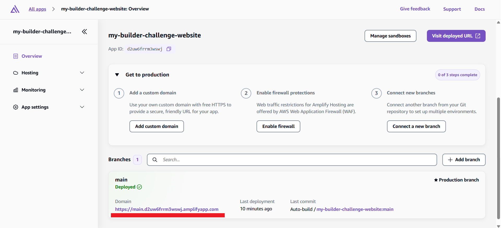

### Output


---

## 🔄 Test Automatic Deployments

```bash
After updating "index.html" on GitHub, changes are automatically deployed.
Wait for completion (1-2 minutes).
Test your site: Refresh your Amplify URL to see the changes.
```


### Deployment
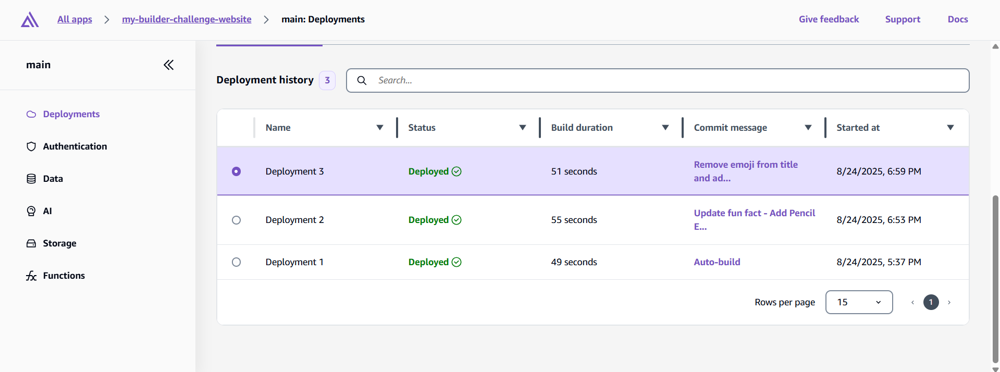

### Output After GitHub Update
```bash
You just experienced modern web development: you made a change to your code on GitHub, and within minutes your live website updated automatically—no manual uploads or cache invalidation needed!
```
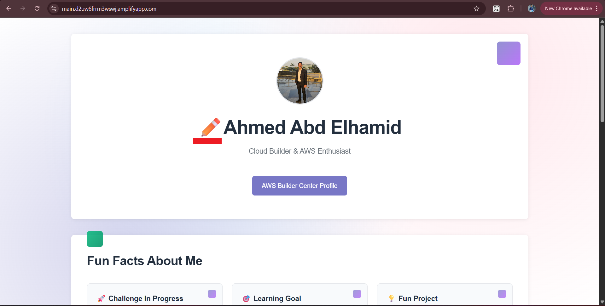

---

## 🧹 Clean Up Your Manual Setup

Once your Amplify site is deployed and your content appears as expected:
```bash
- Delete CloudFront distribution → Disable (wait 5-10 minutes) → Delete
- Clean up S3 bucket → Empty bucket → Delete bucket
```

---

# 4️⃣ Build Contact Form 📧 — Making Your Website Interactive

> Contact forms allow visitors to reach you directly.  
> You'll learn why a professional contact form needs more than just HTML!

## What Happens When Someone Clicks 'Submit'?  
```bash
Client-server exchange:
1) JavaScript packages the data and makes an API call to a server
2) Server receives the API call and processes it (validates, stores, sends emails, etc.)
3) Server responds back to the JavaScript - "success!" or "error"
4) JavaScript updates the page based on the response

Traditional Server: You'd rent a server that's always running, waiting for messages.
Serverless Functions: Code only runs when needed. Someone submits a form → code runs, processes message, then stops.
```

---

## 2️⃣ Receive Notifications with SNS 📬

### Create Topic
```bash
# Create topic
Topic Name → Type(Standard) → Create topic
```
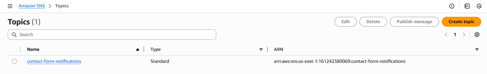

### Create Subscription
```bash
Create subscription → Protocol(Email) → Endpoint <Your-Email> → Create subscription
```
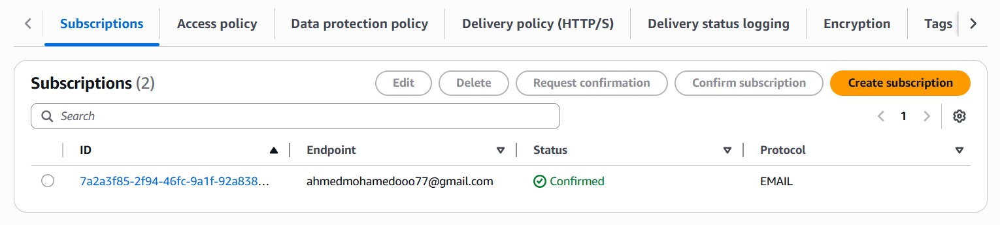

### Confirm Subscription
```bash
Check your email (including Spam) for a confirmation message from AWS.
Click the link to confirm your subscription.
```
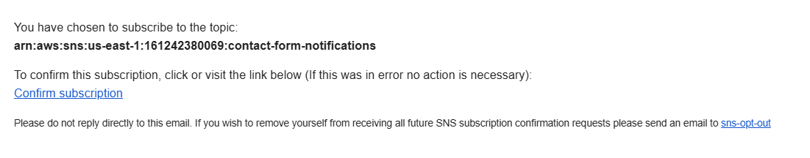
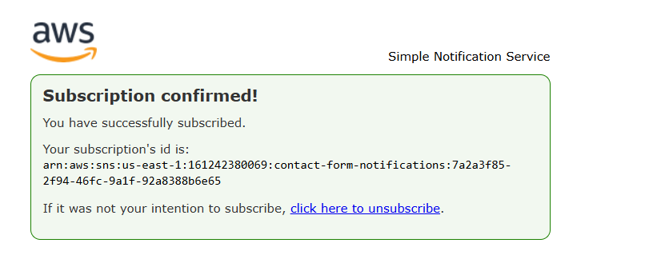

### Publish Message
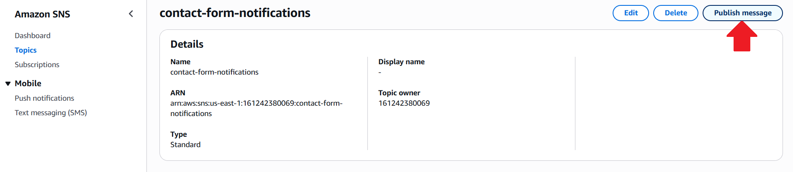
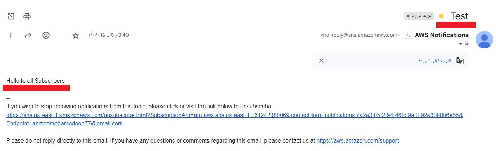

---

## 3️⃣ Configure Permissions 🔐

We need to give our contact form code permission to send emails via SNS.

### Create Policy
```bash
IAM → Policies → Create policy
    → Select a service - SNS
    → Actions allowed - Search for "Publish" and select it
    → Resources - (Specific) - Add ARNs (Text) "Copy SNS-ARN" and add
    → Next
    → Policy name "ContactFormSNSPublish" → Create policy
```
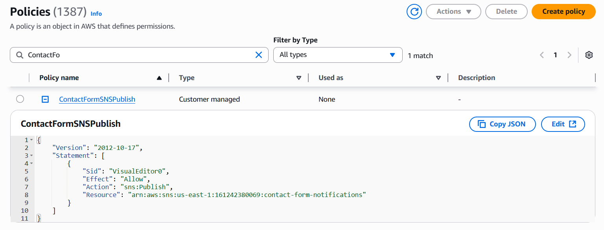

### Create Role
```bash
IAM → Roles → Create role → Trusted entity type "AWS Service"
    → Use case "Lambda" → Next

AWSLambdaBasicExecutionRole → lets Lambda write logs for debugging
Add permissions → Select (ContactFormSNSPublish, AWSLambdaBasicExecutionRole) → Next
Role name, Description → Create role
```
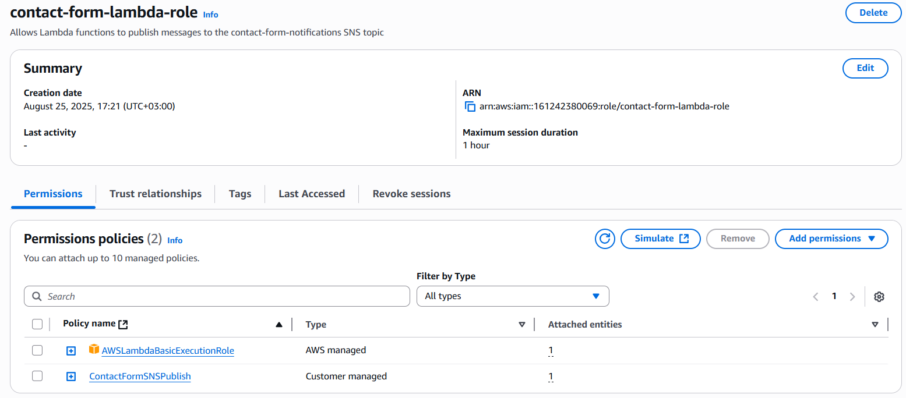

---

## 4️⃣ Write the Code to Process Messages 💻

AWS Lambda runs your code in response to events, like form submissions. Lambda will:
- Receive the form data
- Run your code to process it
- Send the message to your SNS topic (which emails you)
- Send a response back to the visitor's browser

All without managing servers!

### Create AWS Lambda Function
```bash
AWS Lambda
Create a function → Choose "Author from scratch"
    → Function name: "contact-form-function"
    → Runtime: "Python 3.13"
Set permissions: Change default execution role → Select "Use an existing role"
    → Choose "contact-form-lambda-role"
    → Create function
```
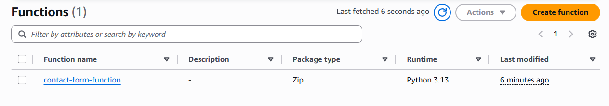

### Add Code
Replace the default code with the following.  
Remember to replace `"YOUR_TOPIC_ARN_HERE"` with your actual Topic ARN.

```python
import json
import boto3

def lambda_handler(event, context):
    try:
        # Parse the form data from the request
        body = json.loads(event['body'])
        name = body.get('name', '')
        email = body.get('email', '')
        message = body.get('message', '')

        # Validate that all required fields are present
        if not all([name, email, message]):
            return {
                'statusCode': 400,
                'body': json.dumps({'error': 'Missing required fields'})
            }

        # Format the notification message
        notification_message = f"""Contact Form Submission

            Name: {name}
            Email: {email}

            Message:
            {message}"""

        # Send notification via SNS
        sns = boto3.client('sns')
        sns.publish(
            TopicArn='YOUR_TOPIC_ARN_HERE',  # Replace with your Topic ARN 👇
            Subject=f'Contact Form: {name}',
            Message=notification_message
        )

        # Return success response
        return {
            'statusCode': 200,
            'body': json.dumps({'message': 'Message sent successfully!'})
        }

    except Exception as e:
        # Return error response if anything goes wrong
        return {
            'statusCode': 500,
            'body': json.dumps({'error': 'Failed to send message'})
        }
```

---

## 5️⃣ Create a Function URL 🌐

Your code exists, but how does your webpage call it?  
"Function URLs" give your Lambda function a web address.

### Create a Function URL
```bash
In your Lambda function → Configuration → "Function URL" → Create function URL
Auth type: NONE (allows public access - fine for contact forms)
```
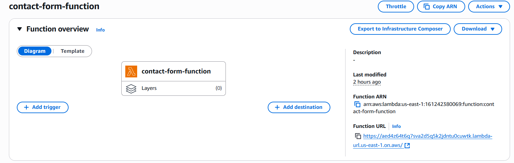

### Configure CORS
CORS is a security feature that controls which websites can call your function.  
Since your contact form and Lambda function are on different domains, you need to allow your website domain.

```bash
Additional settings → Configure cross-origin resource sharing (CORS)
Allow origin: Add your AWS Amplify URL
Allow headers: Add "Content-Type"
Allow methods: "POST"
Save
```

---

## 6️⃣ Add the Contact Form to Your Website 📝

Now let's add the contact form code to your website.  
Since your website is connected to GitHub, you can edit your code directly in your browser:

- Add contact form to `index.html`
- Update `.css`
- Update `.js`
- Commit changes to GitHub
- After commit changes "AWS Amplify" will take 2-3 minutes to deploy changes.

---

## 7️⃣ Test Everything 🧪

Let's make sure everything works end-to-end.
```bash
Visit your contact page - Go to your Amplify website and scroll down to the contact form section
Fill out the form:
Enter your name
Enter your email address
Write a test message
Click "Send Message"
Check it worked:
You should see a success message on the webpage
Check your email - you should get a notification within 30 seconds
The form should clear after sending
```
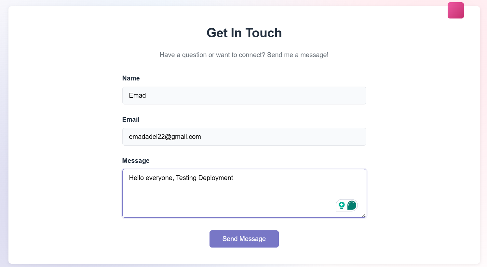
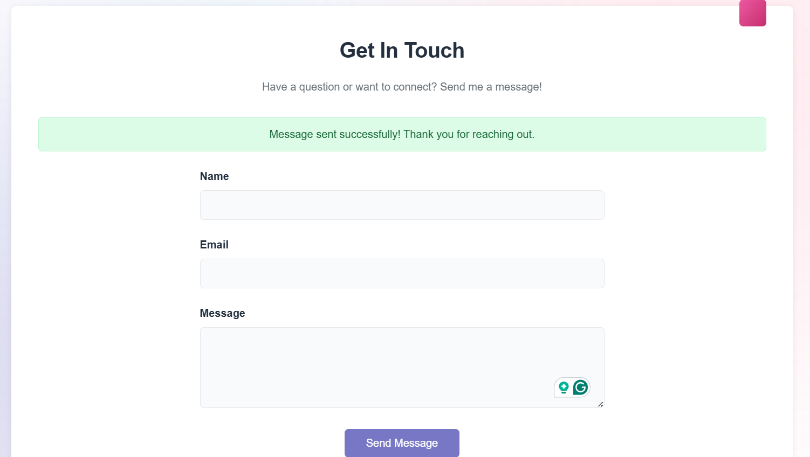

### AWS Amplify 
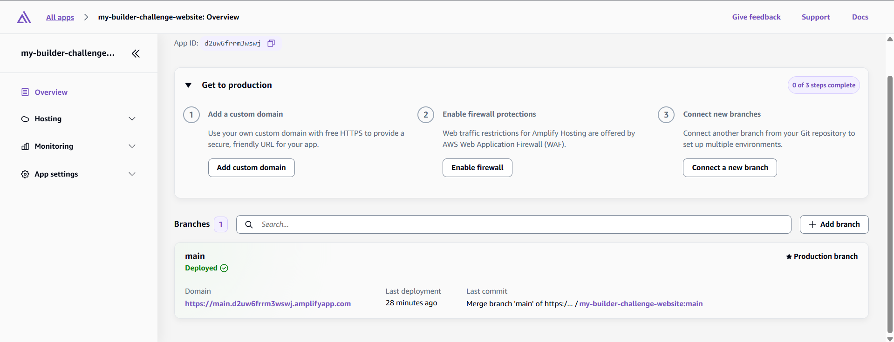
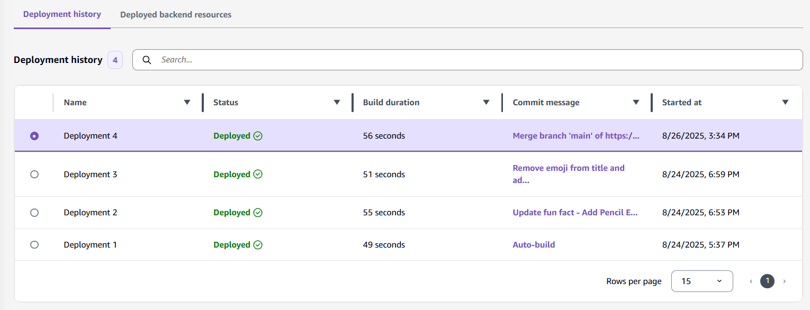
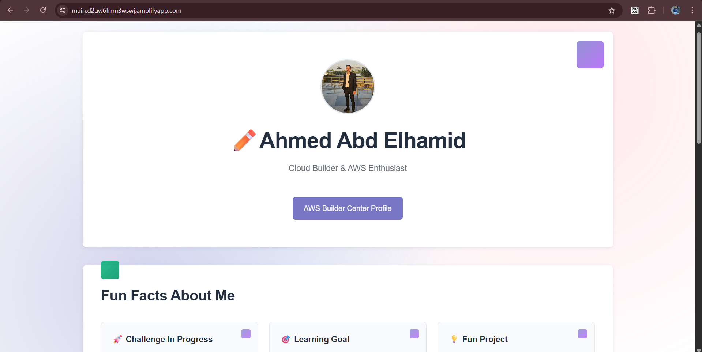

### SNS Topics
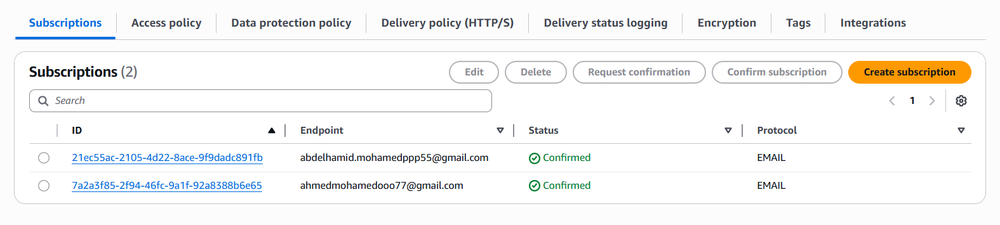
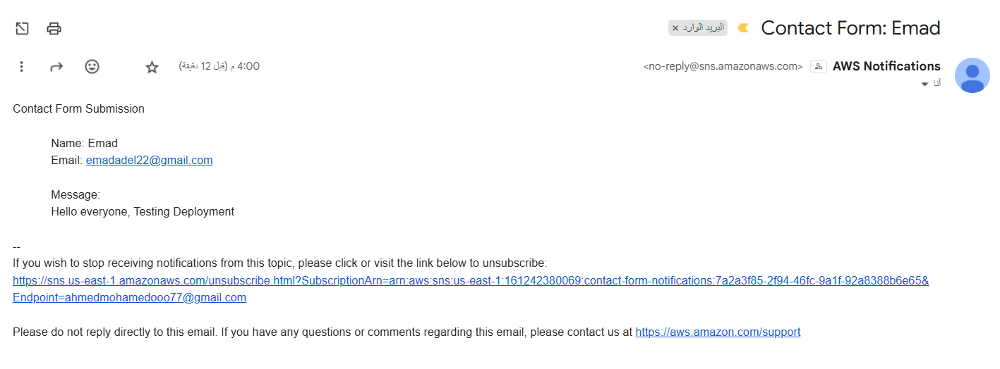
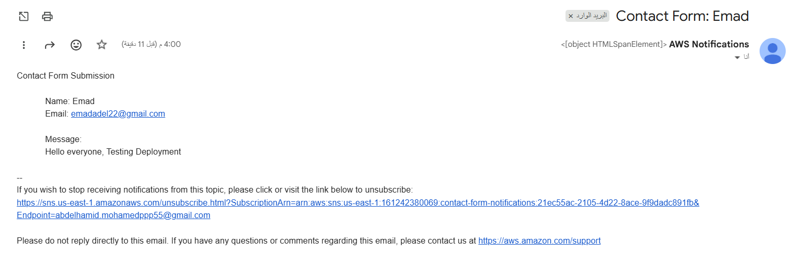

### If something goes wrong 😖
```bash
Check some of the common problems and solutions here. If you’re still running into issues, leave a comment with details so I can help out.

- No email received?
Check your spam folder
Make sure you confirmed your SNS subscription
Verify the Topic ARN in your Lambda code is correct

- Form shows an error?
Check your browser's developer console (F12) for error messages
Make sure your Lambda Function URL is correct in the HTML

- Still having issues?
In Lambda, go to "Monitor" → "View CloudWatch logs"
Look for error messages that explain what went wrong
```

---

## 🎯 Summary

- ✅ **S3 Bucket:** Secure & private storage
- 🌍 **CloudFront:** Fast, reliable global CDN delivery
- 🛠️ **AWS Amplify:** Same infrastructure as manual (CloudFront + S3), plus automation and developer-friendly features
- 🤖 **Amplify + GitHub:** Automated, professional deployments
- 📧 **Contact Form:** Sends you email notifications when visitors send you a message
- 📣 **SNS:** Send notifications to subscribers
- 🦾 **AWS Lambda:** Serverless function to process contact form submissions and trigger notifications

---

Check MY [AWS Builder Center](https://builder.aws.com/content/31piCGegopJKWHGrxUdk2dhvmpD/my-aws-builder-challenge-journey)

> Ready to deploy? Your website is now secure, fast, and professionally managed!  
> Happy coding! ✨